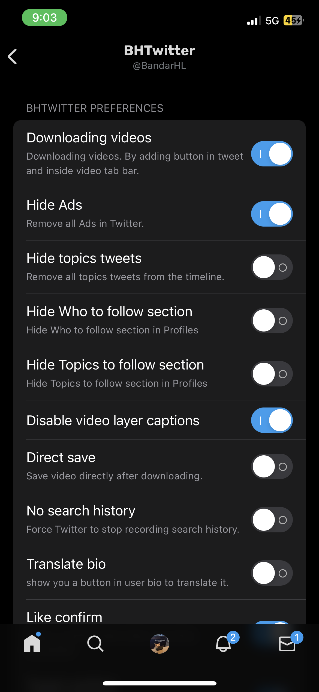
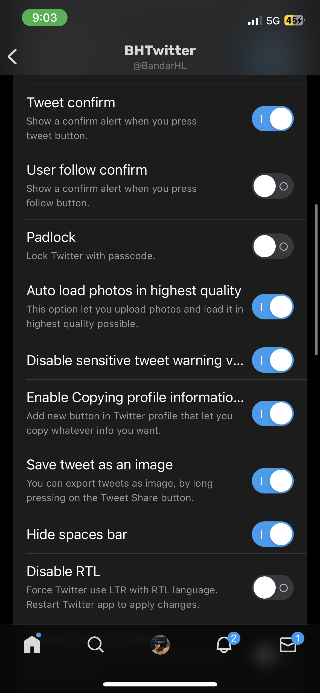
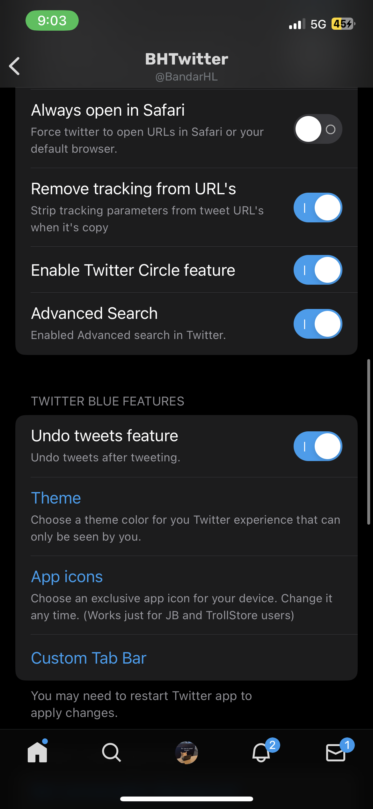
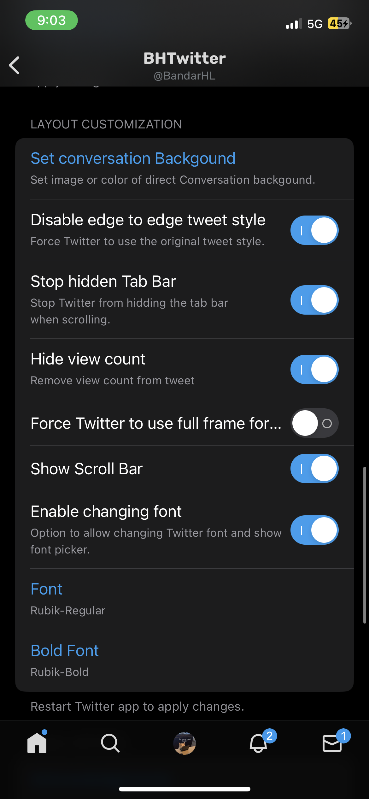

# BHTwitter

An awesome tweak for Twitter that enhances your experience with additional features and customization options. Get rid of ads, gain access to Twitter Blue features for free and much much more! 

## First-Time Sideloading Instructions

> **Important:** If you are sideloading Twitter/X for the first time, follow these steps in order.

### Steps:

1. **Sideload the Login Fix IPA first**  
   This is required to bypass Twitter login guardrails.

2. **Install the latest TwitterX IPA**  
   Overwrite the Login Fix app by installing the updated **TwitterX IPA** on top of it. be sure it has the same Bundle ID.

### Login Process:

- Open the app and go to the login page.  
- You will see a **red button** appear over the login screen.  
- Tap on the red button, then proceed with your normal login.
---
**Note:**  
- Always install the Login Fix IPA first on a fresh install.  
- After the initial setup, you can directly overwrite with newer TwitterX versions.

## Features
*Please note that we heavily rely on feature flags. If a feature doesn't work anymore, it's beacuse Twitter most likely removed support for it.*

###  General Enhancements 
- Download videos (even from private accounts)
- Load photos in highest quality available
- Save Tweets as images
- Undo Tweet
- Enable voice Tweets & voice messages in DM
- Enable new DM search UI

###  UI Customization
- Custom tab bar
- Themes (like Twitter Blue)
- App icon changer
- Font changer
- Padlock
- Disable edge-to-edge Tweet style
- Always open in Safari
- Hide Spaces bar
- Hide topics Tweets
- No history feature
- Disable RTL (Right-To-Left)
- Disable video layer caption

###  Interaction & Behavior
- Twitter Circle feature
- Copy profile information
- Translate bio
- Confirm alerts on:
  - Tweet
  - Like
  - Follow

## Screenshots

|  |  |  |
|:----------:|:----------:|:----------:|
|  |

#### Options:
- `--rootfull` : Build for rootfull deployment
- `--rootless` : Build for rootless deployment
- `--trollstore` : Build for TrollStore deployment
- *(No option)* or `--sideloaded` : Build for sideloaded deployment 

###  GitHub Actions

1. Fork this repository
2. Enable workflows in the **Actions** tab
3. Select the **Build and Release TwitterX** workflow
4. Input required parameters and run the workflow
   - Choose deployment type (`rootfull`, `rootless`, `sideloaded`, `trollstore`)
   - For sideloaded/trollstore: provide a valid URL to decrypted IPA
   - For rootfull/rootless: any value works
